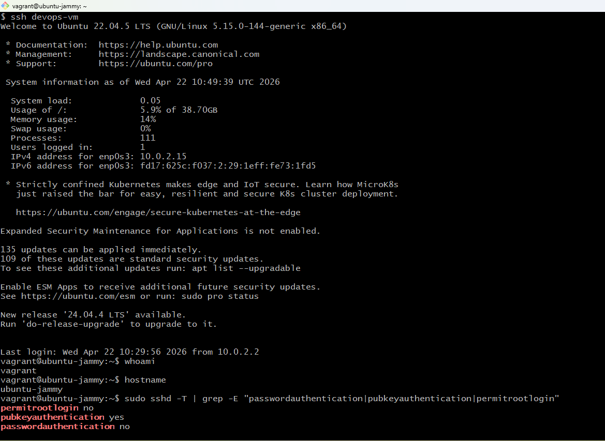

# Task 1: Server Setup and SSH Configuration

Provisioned an Ubuntu 22.04 VM using Vagrant on VirtualBox (Windows 11 host), configured OpenSSH, and set up passwordless login using an Ed25519 key pair.

---

## Environment

| Property | Value |
|----------|-------|
| Host OS | Windows 11 |
| Hypervisor | VirtualBox |
| VM Manager | Vagrant |
| VM OS | Ubuntu 22.04 LTS (ubuntu/jammy64) |
| VM Hostname | ubuntu-jammy |
| SSH Host | 127.0.0.1 via NAT forwarding (see note below) |
| SSH Port | 2222 (Vagrant forwarded port) |
| SSH User | vagrant |
| Shell (Host) | Git Bash (MINGW64) |

---

## Steps

### 1. Start the VM

```bash
cd E:/vagrant-vms/ubuntu
vagrant up
vagrant status
```

Output:
```
Current machine states:
default                   running (virtualbox)
```

Check what SSH config Vagrant is using:
```bash
vagrant ssh-config
```

Output:
```
Host default
  HostName 127.0.0.1
  User vagrant
  Port 2222
  PasswordAuthentication no
  IdentityFile E:/vagrant-vms/ubuntu/.vagrant/machines/default/virtualbox/private_key
```

---

### 2. Verify SSH is running on the VM

```bash
vagrant ssh
sudo systemctl status ssh
```

Output:
```
● ssh.service - OpenBSD Secure Shell server
     Active: active (running)
```

---

### 3. Generate Ed25519 key pair on Windows host

```bash
ssh-keygen -t ed25519 -C "devops-vm" -f ~/.ssh/devops_vm
```

Press Enter twice for no passphrase — that's what makes the login passwordless.

```bash
ls ~/.ssh/
# devops_vm        ← private key (never share)
# devops_vm.pub    ← public key (copied to VM)
```

Public key:
```
ssh-ed25519 AAAAC3NzaC1lZDI1NTE5AAAAIAAfXd82euPFkpRRHnqBBFs0doIcUO/EFB+lR30+g2EG devops-vm
```

---

### 4. Copy public key to the VM

`ssh-copy-id` isn't available on Windows, so did it manually:

```bash
vagrant ssh
mkdir -p ~/.ssh
echo "ssh-ed25519 AAAAC3NzaC1lZDI1NTE5AAAAIAAfXd82euPFkpRRHnqBBFs0doIcUO/EFB+lR30+g2EG devops-vm" > ~/.ssh/authorized_keys
cat ~/.ssh/authorized_keys
```

Used `echo >` instead of nano — first attempt with nano got the key truncated.

**Note on Vagrant's default key:** Vagrant automatically inserts its own insecure key into `authorized_keys` when the VM first boots. That key is still present alongside the Ed25519 key added above. The passwordless login in this task uses the `devops_vm` Ed25519 key specifically — confirmed by the explicit `-i ~/.ssh/devops_vm` flag in the ssh command. In a production setup you'd remove Vagrant's insecure key from `authorized_keys` entirely.

---

### 5. Fix permissions

```bash
chmod 700 ~/.ssh
chmod 600 ~/.ssh/authorized_keys
ls -la ~/.ssh/
```

Output:
```
drwx------  2 vagrant vagrant 4096 Apr 21 18:22 .
drwxr-x--- 10 vagrant vagrant 4096 Apr 21 18:21 ..
-rw-------  1 vagrant vagrant   89 Apr 21 18:22 authorized_keys
```

---

### 6. Harden sshd_config

```bash
sudo nano /etc/ssh/sshd_config
```

Set these three values:
```
PasswordAuthentication no
PubkeyAuthentication yes
PermitRootLogin no
```

```bash
sudo systemctl restart ssh
```

Verified the daemon actually picked up the changes (editing the file alone isn't enough):
```bash
sudo sshd -T | grep -E "passwordauthentication|pubkeyauthentication|permitrootlogin"
```

Output:
```
permitrootlogin no
pubkeyauthentication yes
passwordauthentication no
```

---

### 7. Test passwordless login

From Git Bash on Windows:
```bash
ssh -i ~/.ssh/devops_vm -p 2222 vagrant@127.0.0.1
whoami    # vagrant
hostname  # ubuntu-jammy
```

Logged in instantly with no password prompt.

---

### 8. SSH config shortcut

Added `~/.ssh/config` on the Windows host so I don't have to type the full command every time:

```
Host devops-vm
    HostName 127.0.0.1
    Port 2222
    User vagrant
    IdentityFile ~/.ssh/devops_vm
```

Now just `ssh devops-vm` works.

---

## Note on 127.0.0.1 vs a real server IP

The assignment mentions accessing the server via its IP address. In this Vagrant NAT setup, the VM isn’t directly reachable by a LAN IP — instead Vagrant forwards port 2222 on the host’s `127.0.0.1` through to the VM’s port 22. It works the same way as a real SSH connection, just tunnelled through localhost.

In a bridged network or a cloud VM, you’d replace `127.0.0.1:2222` with the VM’s actual IP on port 22:
```bash
ssh -i ~/.ssh/devops_vm ubuntu@192.168.1.x   # bridged example
ssh -i ~/.ssh/devops_vm ubuntu@10.0.0.x      # cloud VM example
```

---

## Screenshot



`ssh devops-vm` connects without a password prompt. `whoami` and `hostname` confirm the VM identity. `sshd -T` grep shows all three hardened settings are active.

---

## Troubleshooting notes

- Port 2222 occasionally changes after `vagrant halt` + `vagrant up` — if connection fails, run `vagrant ssh-config` to check the current port and update `~/.ssh/config`
- Used `echo "key" > authorized_keys` instead of nano after the first attempt truncated the key
- Always verify with `sshd -T` after editing sshd_config — the file change alone doesn't confirm the daemon reloaded correctly
- Vagrant’s insecure default key stays in `authorized_keys` alongside yours — both work, but the `-i ~/.ssh/devops_vm` flag in the ssh command confirms it’s your key doing the authentication

---

## Files

| File | Description |
|------|-------------|
| `sshd_config` | Hardened SSH daemon config (from `/etc/ssh/sshd_config` on VM) |
| `ssh_config` | SSH client shortcut config (from `~/.ssh/config` on Windows host) |
| `screenshot-ssh-login.png` | Passwordless login + sshd verification output |
