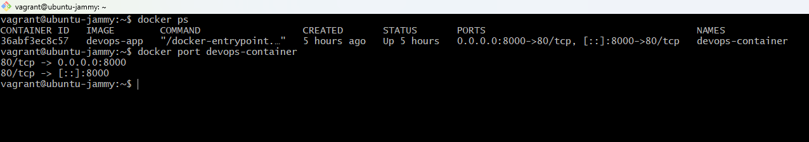
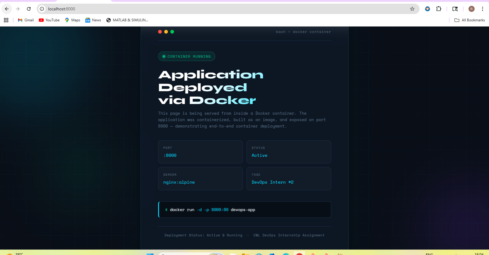

# Task 2: Docker Installation and Application Deployment

Installed Docker on the Vagrant VM, built a custom nginx image from a Dockerfile, and ran it as a container on port 8000. The app is accessible from the Windows browser via Vagrant's port forwarding.

---

## Environment

| Property | Value |
|----------|-------|
| VM OS | Ubuntu 22.04 LTS |
| Docker Version | 29.4.1 |
| Base Image | nginx:alpine |
| Container Name | devops-container |
| Port Mapping | host:8000 → container:80 |
| Access URL | http://localhost:8000 |

---

## Files

```
Task-2/
├── Dockerfile
├── index.html
└── README.md
```

---

## Steps

### 1. Install Docker

```bash
# Remove any old versions
sudo apt remove docker docker-engine docker.io containerd runc 2>/dev/null

# Install prerequisites
sudo apt update
sudo apt install -y ca-certificates curl gnupg lsb-release

# Add Docker's GPG key
sudo install -m 0755 -d /etc/apt/keyrings
curl -fsSL https://download.docker.com/linux/ubuntu/gpg | \
  sudo gpg --dearmor -o /etc/apt/keyrings/docker.gpg
sudo chmod a+r /etc/apt/keyrings/docker.gpg

# Add the repo
echo \
  "deb [arch=$(dpkg --print-architecture) signed-by=/etc/apt/keyrings/docker.gpg] \
  https://download.docker.com/linux/ubuntu \
  $(. /etc/os-release && echo "$VERSION_CODENAME") stable" | \
  sudo tee /etc/apt/sources.list.d/docker.list > /dev/null

# Install
sudo apt update
sudo apt install -y docker-ce docker-ce-cli containerd.io docker-buildx-plugin docker-compose-plugin

# Start and enable
sudo systemctl start docker
sudo systemctl enable docker

# Let vagrant user run docker without sudo
sudo usermod -aG docker $USER
newgrp docker
```

Verify it worked:
```bash
docker --version
# Docker version 29.4.1, build 055a478

docker run hello-world
# Hello from Docker!
```

---

### 2. The Dockerfile

```dockerfile
FROM nginx:alpine
RUN rm -rf /usr/share/nginx/html/*
COPY index.html /usr/share/nginx/html/index.html
EXPOSE 80
CMD ["nginx", "-g", "daemon off;"]
```

Used `nginx:alpine` — it's only ~23MB and has a minimal attack surface compared to the full nginx image.

---

### 3. Build the image

```bash
cd /vagrant/Project-Submission/Project-Submission/Task-2
docker build -t devops-app .
```

Output:
```
[+] Building 19.0s (8/8) FINISHED
 => [1/3] FROM docker.io/library/nginx:alpine     12.4s
 => [2/3] RUN rm -rf /usr/share/nginx/html/*       1.6s
 => [3/3] COPY index.html /usr/share/nginx/...     0.2s
```

```bash
docker images
# REPOSITORY   TAG       IMAGE ID       CREATED        SIZE
# devops-app   latest    78ead119f9fd   2 min ago      47.1MB
```

---

### 4. Run the container

```bash
docker run -d \
  --name devops-container \
  -p 8000:80 \
  --restart unless-stopped \
  devops-app
```

`--restart unless-stopped` means it comes back up automatically after a VM reboot.

---

### 5. Verify it's running

```bash
docker ps
```

Output:
```
CONTAINER ID   IMAGE        COMMAND                  STATUS        PORTS
36abf3ec8c57   devops-app   "/docker-entrypoint.…"  Up 5 seconds  0.0.0.0:8000->80/tcp
```

```bash
docker port devops-container
# 80/tcp -> 0.0.0.0:8000
```

---

### 6. Access from Windows browser

The Vagrantfile has port forwarding set up:
```ruby
config.vm.network "forwarded_port", guest: 8000, host: 8000
```

So opening `http://localhost:8000` on Windows goes: browser → Windows port 8000 → VM port 8000 → container port 80 → nginx.

---

## Screenshots



Container running in detached mode, port mapping confirmed.



Custom page loaded at `http://localhost:8000` from Windows browser.

---

## Troubleshooting notes

- Hit a `corrupted -- crc32 mismatch` error during the first build — the image layer download got interrupted. Fixed with `docker builder prune -f && docker system prune -f` then rebuilt
- `docker build` was hanging initially because the VM only had 1GB RAM — bumped it to 2048MB in the Vagrantfile
- Browser couldn't reach port 8000 until I added the `forwarded_port` line to the Vagrantfile and ran `vagrant reload`

---

## Useful commands

```bash
docker stop devops-container
docker start devops-container
docker logs devops-container
docker stats devops-container      # live resource usage
docker system prune -f             # cleanup unused images/containers
```
