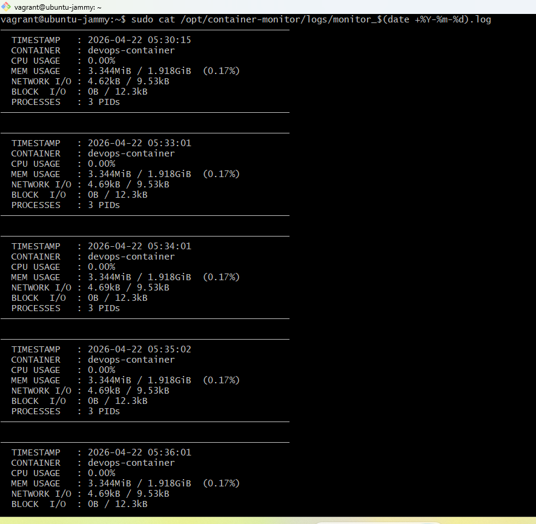

# Task 3: Automated Container Resource Monitoring

Wrote a bash script that snapshots the container's resource usage every minute via cron and writes it to log files in `/opt/container-monitor/logs/`.

---

## Environment

| Property | Value |
|----------|-------|
| VM OS | Ubuntu 22.04 LTS |
| Container monitored | devops-container |
| Log directory | /opt/container-monitor/logs/ |
| Cron frequency | Every minute |
| Cron user | monitor (see Task 4) |

---

## Files

```
Task-3/
├── monitor.sh
└── README.md
```

---

## How the script works

```
monitor.sh (runs every minute via cron)
    │
    ├── Checks container is actually running
    │       └── logs WARNING and exits if not
    │
    ├── Pulls a single stats snapshot via docker stats --no-stream
    │       └── CPU%, memory, network I/O, block I/O, PIDs
    │
    ├── Writes a human-readable block → monitor_YYYY-MM-DD.log
    │
    └── Appends a CSV line → monitor_YYYY-MM-DD.csv
```

Two formats: the `.log` is easy to read in a terminal, the `.csv` is there if you want to import it into a spreadsheet or feed it to something later.

---

## Setup

### 1. Create the log directory

```bash
sudo mkdir -p /opt/container-monitor/logs
```

### 2. Copy the script

```bash
sudo cp /vagrant/Project-Submission/Project-Submission/Task-3/monitor.sh /opt/container-monitor/monitor.sh
sudo chmod +x /opt/container-monitor/monitor.sh
```

### 3. Test it manually first

```bash
sudo /opt/container-monitor/monitor.sh
cat /opt/container-monitor/logs/monitor_$(date +%Y-%m-%d).log
```

Output:
```
─────────────────────────────────────────────────────
  TIMESTAMP   : 2026-04-22 05:30:15
  CONTAINER   : devops-container
  CPU USAGE   : 0.00%
  MEM USAGE   : 3.344MiB / 1.918GiB  (0.17%)
  NETWORK I/O : 4.62kB / 9.53kB
  BLOCK  I/O  : 0B / 12.3kB
  PROCESSES   : 3 PIDs
─────────────────────────────────────────────────────
```

### 4. Set up cron

The cron job runs as the `monitor` user (not root) — see Task 4 for why.

```bash
sudo crontab -u monitor -e
```

Add:
```
* * * * * /opt/container-monitor/monitor.sh
```

Verify it saved:
```bash
sudo crontab -u monitor -l
# * * * * * /opt/container-monitor/monitor.sh
```

Check cron is running:
```bash
sudo systemctl status cron
# Active: active (running)
```

### 5. Wait a few minutes and check

```bash
sudo -u monitor ls -la /opt/container-monitor/logs/
```

Output:
```
-rw-r--r-- 1 monitor monitor  2154 Apr 22 05:53 monitor_2026-04-22.csv
-rw-r--r-- 1 monitor monitor 11340 Apr 22 05:53 monitor_2026-04-22.log
```

---

## Screenshot



Multiple timestamped entries showing the cron job running automatically every minute.

---

## Log format

**Human-readable (`.log`):**
```
─────────────────────────────────────────────────────
  TIMESTAMP   : 2026-04-22 05:35:02
  CONTAINER   : devops-container
  CPU USAGE   : 0.00%
  MEM USAGE   : 3.344MiB / 1.918GiB  (0.17%)
  NETWORK I/O : 4.69kB / 9.53kB
  BLOCK  I/O  : 0B / 12.3kB
  PROCESSES   : 3 PIDs
─────────────────────────────────────────────────────
```

**CSV (`.csv`):**
```
timestamp,container,cpu_percent,mem_usage,mem_percent,net_io,block_io,pids
2026-04-22 05:35:02,devops-container,0.00%,3.344MiB / 1.918GiB,0.17%,...
```

---

## Useful commands

```bash
# How many entries logged today
grep "TIMESTAMP" /opt/container-monitor/logs/monitor_$(date +%Y-%m-%d).log | wc -l

# Live tail
sudo tail -f /opt/container-monitor/logs/monitor_$(date +%Y-%m-%d).log

# Clean up old logs (run manually or add to a weekly cron)
find /opt/container-monitor/logs/ -name "*.log" -mtime +30 -delete
```
