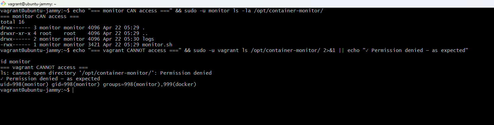

# Task 4: Secure Monitoring Logs — Dedicated User & Access Control

Created a dedicated `monitor` system user, gave it ownership of `/opt/container-monitor`, locked out everyone else with `chmod 700`, and moved the cron job from root to this user.

---

## Environment

| Property | Value |
|----------|-------|
| VM OS | Ubuntu 22.04 LTS |
| Dedicated user | monitor |
| Login shell | /sbin/nologin |
| Monitoring directory | /opt/container-monitor |
| Permissions | 700 (owner full, everyone else blocked) |
| monitor UID | 998 |
| monitor groups | monitor, docker |

---

## Files

```
Task-4/
├── setup_monitor_user.sh
└── README.md
```

---

## Security design

```
/opt/container-monitor/        owned by monitor:monitor, chmod 700
    ├── monitor.sh             chmod 700
    └── logs/                  chmod 700
            ├── monitor_YYYY-MM-DD.log
            └── monitor_YYYY-MM-DD.csv

monitor user  → full access (rwx)
vagrant user  → Permission denied
root          → can access via sudo
```

The main reason for a dedicated user: running the cron job as root is a bad habit even on a local VM — if something went wrong with the script it would have full system access. The `monitor` user can only touch its own directory and run docker commands, nothing else.

---

## Setup

### Run the script

```bash
cd /vagrant/Project-Submission/Project-Submission/Task-4
sudo bash setup_monitor_user.sh
```

The script checks it's running as root, then handles everything: creates the user, makes the directory, sets ownership and permissions, adds the user to the docker group.

Actual output:
```
════════════════════════════════════════════════
 Setting up dedicated monitoring user & access
════════════════════════════════════════════════

[1/6] Creating user 'monitor'...
      ✓ User 'monitor' created.
[2/6] Creating monitoring directory at /opt/container-monitor...
      ✓ Directory created.
[3/6] Assigning ownership to 'monitor'...
      ✓ Ownership assigned.
[4/6] Setting permissions (700 — owner full, others none)...
      ✓ Permissions set to 700.
[5/6] Installing monitor.sh into /opt/container-monitor...
      ⚠ monitor.sh not found in current directory. Copy it manually.
[6/6] Adding 'monitor' to docker group...
      ✓ Added to docker group.
```

The `⚠ monitor.sh not found` message showed up because the script was run from the Task-4 directory, not Task-3 where `monitor.sh` lives. Copied it manually after:

```bash
sudo chown monitor:monitor /opt/container-monitor/monitor.sh
sudo chmod 700 /opt/container-monitor/monitor.sh
```

---

### Verify directory state

```bash
sudo ls -la /opt/container-monitor/
```

Output:
```
drwx------ 3 monitor monitor 4096 Apr 22 05:29 .
drwxr-xr-x 4 root    root    4096 Apr 22 05:29 ..
drwx------ 2 monitor monitor 4096 Apr 22 05:30 logs
-rwx------ 1 monitor monitor 3421 Apr 22 05:29 monitor.sh
```

---

### Move cron to monitor user

```bash
sudo crontab -u monitor -e
# * * * * * /opt/container-monitor/monitor.sh

sudo crontab -u monitor -l
# * * * * * /opt/container-monitor/monitor.sh
```

---

### Verify access control

monitor user can access:
```bash
sudo -u monitor ls -la /opt/container-monitor/
# shows directory contents normally
```

vagrant user cannot:
```bash
sudo -u vagrant ls /opt/container-monitor/
# ls: cannot open directory '/opt/container-monitor/': Permission denied
```

---

## Screenshot



monitor user successfully lists the directory. vagrant user gets `Permission denied`. Both tests in the same terminal window.

---

## Why a system user and not a regular user

A system user (`--system`) has no home directory, no login shell (`/sbin/nologin`), and a UID below 1000 — it's meant for services, not people. No one can `ssh` in as `monitor` or `su - monitor` interactively. It only exists to own the monitoring files and run the cron job.
