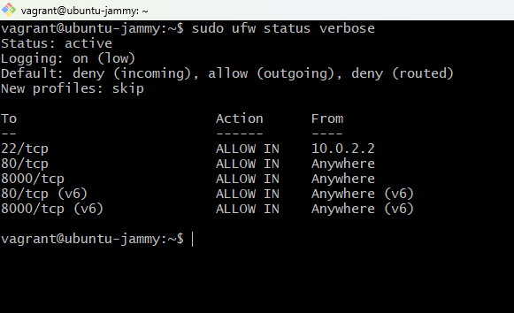

# Task 5: Firewall Configuration with UFW

Configured UFW to deny all incoming traffic by default, restrict SSH to the Windows host IP only, and allow HTTP and port 8000 for the Docker app.

---

## Environment

| Property | Value |
|----------|-------|
| VM OS | Ubuntu 22.04 LTS |
| Firewall | UFW |
| Trusted SSH IP | 10.0.2.2 (VirtualBox NAT gateway) |
| Default incoming | DENY |
| Default outgoing | ALLOW |

---

## Files

```
Task-5/
├── firewall_setup.sh
└── README.md
```

---

## Finding the trusted SSH IP

In a Vagrant + VirtualBox NAT setup the Windows host isn't directly visible by its actual IP — it's reachable from the VM through the VirtualBox NAT gateway. Found it with:

```bash
ip route | grep default
```

Output:
```
default via 10.0.2.2 dev enp0s3 proto dhcp src 10.0.2.15 metric 100
```

So `10.0.2.2` is the Windows host from the VM's perspective. That's the only IP that should be allowed SSH.

---

## Setup

### Update the script with the correct IP, then run it

```bash
# Confirm the IP first
ip route | grep default

# Update the placeholder in the script
sed -i 's/TRUSTED_SSH_IP="192.168.56.1"/TRUSTED_SSH_IP="10.0.2.2"/' firewall_setup.sh

cd /vagrant/Project-Submission/Project-Submission/Task-5
sudo bash firewall_setup.sh
```

Actual output:
```
════════════════════════════════════════════════
 Configuring UFW Firewall
 Trusted SSH IP: 10.0.2.2
════════════════════════════════════════════════

[1/8] Installing UFW...        ✓ UFW available.
[2/8] Resetting UFW...         ✓ UFW reset.
[3/8] Default policies...      ✓ DENY incoming, ALLOW outgoing.
[4/8] Allow SSH from 10.0.2.2  ✓ SSH allowed from 10.0.2.2.
[5/8] Allow HTTP (80)...       ✓ HTTP (80/tcp) allowed.
[6/8] Allow port 8000...       ✓ Port 8000/tcp allowed.
[7/8] Enabling UFW...          ✓ UFW enabled.

Status: active
To                         Action      From
22/tcp                     ALLOW IN    10.0.2.2
80/tcp                     ALLOW IN    Anywhere
8000/tcp                   ALLOW IN    Anywhere
```

---

### Verify rules

```bash
sudo ufw status verbose
```

---

### Test everything still works

SSH from Git Bash (should work — we're coming from 10.0.2.2):
```bash
ssh devops-vm
# connects fine
```

Browser at `http://localhost:8000` (should work — port 8000 is allowed):
```
page loads
```

Try a blocked port:
```bash
nc -zv 127.0.0.1 3306
# Connection refused — MySQL port blocked as expected
```

---

## Screenshot



Active rules: SSH restricted to 10.0.2.2, HTTP and 8000 open to anywhere, everything else denied.

---

## Firewall rules summary

| Port | From | Action | Reason |
|------|------|--------|--------|
| 22/tcp | 10.0.2.2 only | ALLOW | SSH — Windows host only |
| 80/tcp | Anywhere | ALLOW | HTTP |
| 8000/tcp | Anywhere | ALLOW | Docker app |
| everything else | Anywhere | DENY | Default policy |

---

## Notes

- The SSH IP restriction is the most important rule here — it's what actually stops brute-force attempts
- UFW persists across reboots automatically once enabled
- For production you'd also want `ufw limit 22/tcp` to rate-limit connection attempts, and port 443 for HTTPS

---

## Manual steps (without the script)

```bash
sudo ufw --force reset
sudo ufw default deny incoming
sudo ufw default allow outgoing
sudo ufw allow from 10.0.2.2 to any port 22 proto tcp
sudo ufw allow 80/tcp
sudo ufw allow 8000/tcp
sudo ufw --force enable
sudo ufw status verbose
```
